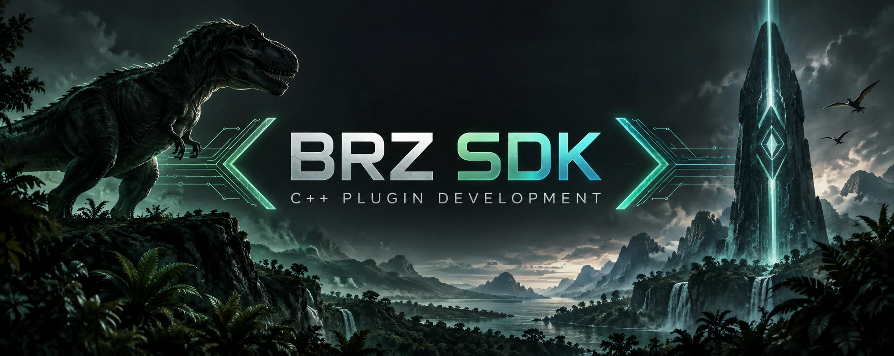
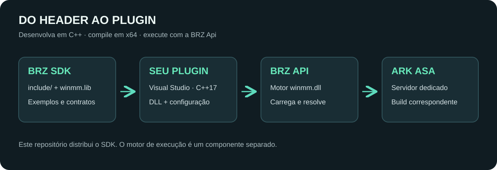

<p align="center"></p>

<p align="center"><strong>Do primeiro comando ao plugin integrado ao jogo.</strong><br>SDK C++ da BRZ Api para ARK: Survival Ascended.</p>

<p align="center">Windows x64 · C++17 · API 29 · Build de referência 25090264</p>

<p align="center"><a href="https://github.com/andrew-mauricio/BRZ-Api-SDK/releases/latest">📦 Baixar SDK</a> · <a href="docs/GUIA.md">Guia de desenvolvimento</a> · <a href="examples">Exemplos completos</a> · <a href="docs/VALIDACAO.md">Validação</a></p>

## Uma base para criar, adaptar e corrigir plugins

O **BRZ SDK** reúne os headers usados no desenvolvimento da BRZ Api, os tipos do jogo e a biblioteca de importação do motor. Esta distribuição é uma cópia dos headers de `C:\ark\SDK`, acompanhada de exemplos e ferramentas para a comunidade compilar seus próprios plugins.

Nosso objetivo é dar uma base ampla para resolver necessidades de plugins: investigar incompatibilidades, adaptar código existente e implementar novas funções usando uma interface comum. É possível compilar projetos C++ sobre essa base quando eles atendem aos contratos expostos pelo SDK. **A compatibilidade de cada plugin e função precisa ser verificada**: nenhum SDK garante, sozinho, que qualquer código compile ou funcione em qualquer versão do jogo.

## O que você pode construir

| Projeto | Ponto de partida |
|---|---|
| Comandos administrativos e utilitários | Registro e remoção de comandos de chat e RCON |
| Plugins configuráveis | JSON, validação e reload sem perder a configuração válida |
| Consultas sobre jogadores e dinossauros | Serviços da tabela e headers dos tipos do jogo |
| Integrações com eventos e comportamento do jogo | Interfaces de hooks, respeitando assinaturas e ciclo de vida |
| Sistemas próprios e adaptação de plugins existentes | Tipos, coleções, campos e serviços do SDK; migração das chamadas incompatíveis |

As ideias acima mostram áreas de aplicação das interfaces; não são plugins completos entregues neste pacote. Os dois projetos abaixo são exemplos compiláveis incluídos.

## Entenda a arquitetura



- **SDK:** headers para compilar e `lib/winmm.lib` para resolver importações do motor.
- **Plugin:** a DLL que você desenvolve, com configuração e metadados próprios.
- **BRZ Api:** o motor compatível, carregado no servidor como `winmm.dll`.
- **ARK:** o ambiente real onde objetos, funções e eventos do jogo existem.

**O motor `winmm.dll` e o servidor não acompanham este download.** A biblioteca `.lib` é uma biblioteca de importação, não substitui o motor. Para executar os plugins, você precisa de uma instalação compatível da BRZ Api. Este repositório publica o kit de desenvolvimento.

## Comece em poucos minutos

1. Instale Visual Studio com **Desenvolvimento para desktop com C++**, ferramentas MSVC x64 e Windows SDK.
2. Baixe o [ZIP da release](https://github.com/andrew-mauricio/BRZ-Api-SDK/releases/latest) e extraia a pasta `BRZ-SDK`.
3. Abra o Prompt de Comando nessa pasta e execute:

```bat
tools\build-examples.bat
tools\test-examples.bat
```

O script encontra o Visual Studio com `vswhere`, configura x64 e compila com C++17 e runtime `/MT`. As entregas ficam em `build\plugins\BrzOla` e `build\plugins\BrzDinoInfo`: DLL, PDB, `config.json` e `PluginInfo.json`, além dos intermediários do compilador.

O teste local usa uma tabela simulada para o BrzOla; não exige abrir o servidor. Veja o [guia](docs/GUIA.md) para caminhos personalizados e instalação em ambiente de teste.

## Dois exemplos para aprender e reutilizar

### BrzOla — configuração e RCON

[Ver o código completo](examples/BrzOla/BrzOla.cpp). Registra `BrzOla.Ola` e `BrzOla.Reload`. A mensagem vem do arquivo:

```json
{"mensagem": "Ola, comunidade BRZ!"}
```

Edite a mensagem e execute `BrzOla.Reload` no RCON de um ambiente de teste. Um JSON inválido mantém a configuração anterior. O exemplo também verifica a tabela recebida, desfaz o registro parcial em caso de falha e remove os comandos ao descarregar.

### BrzDinoInfo — tabela de serviços + header do jogo

[Ver o código completo](examples/BrzDinoInfo/BrzDinoInfo.cpp). O comando de chat `/sdkdino` consulta o dinossauro montado e usa `APrimalDinoCharacter::IsBaby()` para informar se ele é filhote. `BrzDinoInfo.Reload` recarrega `{"habilitado": true}`.

```cpp
#include <Brz/BrzPluginApi.h>
#include <Brz/Jogo/APrimalDinoCharacter.h>
// Dentro de um callback com jogador e tabela validos:
// auto* dino = static_cast<APrimalDinoCharacter*>(api->DinoMontado(jogador));
// if (dino) { const bool filhote = dino->IsBaby(); /* responder */ }
```

O exemplo demonstra a ligação ao motor e uma leitura pelo SDK. Sua execução sobre um dinossauro real depende da correspondência entre motor, SDK e build; essa interação não foi testada em servidor nesta publicação.

## O que vem no pacote

| Caminho | Conteúdo |
|---|---|
| `include/` | 976 arquivos: 975 `.h` e um `json.hpp` |
| `include/Brz/Jogo/` | 956 headers, incluindo o agregador `Tudo.h` |
| `include/Brz/Ark.h` | Agregador dos tipos e serviços |
| `include/Brz/BrzPluginApi.h` | Tabela de entrada e contratos do plugin |
| `lib/winmm.lib` | Biblioteca de importação do motor BRZ Api |
| `examples/` | Dois plugins com código, JSON e metadados |
| `tools/` e `tests/` | Compilação e verificação local no Windows |
| `docs/inventario-sdk.json` | Tamanhos e hashes dos headers e da biblioteca |

## Compatibilidade e qualidade

A referência desta edição é **build 25090264 / API 29 / Windows x64**. Compilar prova que o compilador aceitou o código; não prova endereços, tipos, offsets, comportamento ou segurança de toda chamada no servidor. O alias `AsaApi` existente nos headers ajuda na migração de nomes, mas não garante compatibilidade completa com outros SDKs ou plugins antigos.

Os headers foram preservados como snapshot. Alguns comentários internos refletem etapas anteriores do projeto; para esta distribuição, siga a ligação a `winmm.lib` usada nos exemplos. Consulte [o escopo da validação](docs/VALIDACAO.md) antes de adaptar funções do jogo.

## Downloads, licença e colaboração

Baixe o pacote completo e seu SHA-256 nas [releases](https://github.com/andrew-mauricio/BRZ-Api-SDK/releases). Você também pode clonar este repositório: ele contém os mesmos arquivos de desenvolvimento.

Contribuições e relatos de incompatibilidade são bem-vindos nas [issues](https://github.com/andrew-mauricio/BRZ-Api-SDK/issues). Informe build do jogo, versão do motor, compilador, chamada envolvida e um exemplo mínimo reproduzível. Não envie credenciais nem dados privados do servidor.

Código próprio sob [MIT](LICENSE). Dependências mantêm seus avisos e licenças em [THIRD_PARTY_NOTICES.md](THIRD_PARTY_NOTICES.md). Projeto independente; ARK e seus nomes pertencem aos respectivos titulares.
